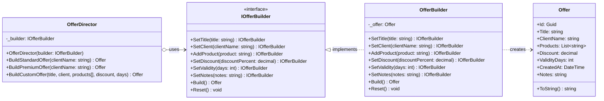
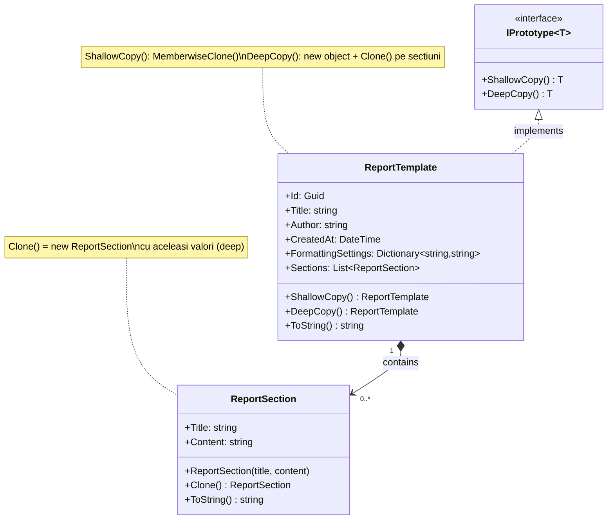
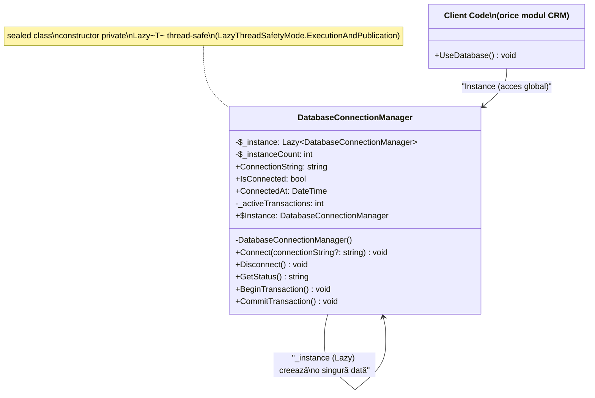
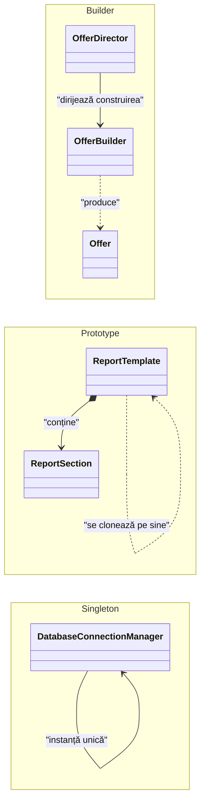

# Laborator 3 – Paternuri de Proiectare Creționale

## Builder, Prototype și Singleton în proiectul TMPP_CRM

---

## 1. Builder Pattern

### Ce este?
Builder separă **logica de construire** a unui obiect complex de **reprezentarea sa finală**. Obiectul este construit **pas cu pas**, iar același proces poate produce reprezentări diferite.

### Componentele implementate

| Clasa | Rol |
|---|---|
| `Offer` | Produsul final construit |
| `IOfferBuilder` | Interfața cu metode fluente |
| `OfferBuilder` | Builder concret (implementare efectivă) |
| `OfferDirector` | Director: gestionează pașii de construire |

### Cum funcționează în CRM?
Un agent de vânzări construiește o **ofertă comercială** selectând produse, discount și valabilitate:

```csharp
var builder = new OfferBuilder();
var director = new OfferDirector(builder);

// Director construieste o oferta Standard predefinita
Offer ofertaStandard = director.BuildStandardOffer("Alpha SRL");

// Sau direct cu fluent API
Offer ofertaCustom = builder
    .SetTitle("Oferta Personalizata")
    .SetClient("Beta SRL")
    .AddProduct("Modul CRM")
    .AddProduct("Modul Rapoarte")
    .SetDiscount(10)
    .SetValidity(45)
    .Build();
```

### Beneficii
- ✅ Construiesc obiecte complexe fără constructori cu zeci de parametri
- ✅ Același Builder poate construi variante diferite (Standard/Premium)
- ✅ Director asigură că pașii se execută întotdeauna în ordinea corectă
- ✅ `Build()` resetează automat builder-ul pentru refolosire

---

## 2. Prototype Pattern

### Ce este?
Prototype permite **clonarea obiectelor existente** fără a depinde de clasa lor concretă. Se definesc două tipuri de copii:
- **Shallow Copy** (copie superficială): obiect nou, dar referințele interne sunt partajate
- **Deep Copy** (copie profundă): obiect complet independent

### Componentele implementate

| Clasa | Rol |
|---|---|
| `IPrototype<T>` | Interfața cu `ShallowCopy()` și `DeepCopy()` |
| `ReportSection` | Secțiune de raport (demonstrează diferența copii) |
| `ReportTemplate` | Șablon raport CRM – implementează `IPrototype<ReportTemplate>` |

### Cum funcționează în CRM?
Un manager duplică un **șablon de raport** pentru a crea variante similare rapid:

```csharp
var templateOriginal = new ReportTemplate("Raport Lunar Vanzari", "Ion Popescu");
templateOriginal.Sections.Add(new ReportSection("Introducere", "Date lunare."));
templateOriginal.FormattingSettings["font"] = "Arial";

// Shallow Copy: sectiunile sunt PARTAJATE (modificarea afecteaza ambele)
var shallowClone = templateOriginal.ShallowCopy();
shallowClone.Sections[0].Content = "Modificat"; // modificat si in original!

// Deep Copy: complet independent
var deepClone = templateOriginal.DeepCopy();
deepClone.Sections[0].Content = "Modificat";    // originalul NEAFECTAT
```

### Diferența Shallow vs Deep

| Aspect | Shallow Copy | Deep Copy |
|---|---|---|
| Obiect nou creat | ✅ Da | ✅ Da |
| ID nou | ✅ Da | ✅ Da |
| Lista `Sections` | ❌ Partajată cu originalul | ✅ Copie independentă |
| `FormattingSettings` | ❌ Partajat | ✅ Copiat |
| Independență completă | ❌ Nu | ✅ Da |

### Beneficii
- ✅ Duplicare rapidă de documente fără reinițializare completă
- ✅ Evită cuplarea față de clasa concretă
- ✅ Flexibilitate: shallow pentru date partajate, deep pentru izolare totală

---

## 3. Singleton Pattern

### Ce este?
Singleton asigură că o clasă are **o singură instanță** accesibilă global, prevenind crearea de copii accidentale.

### Componentele implementate

| Clasa | Rol |
|---|---|
| `DatabaseConnectionManager` | Singleton thread-safe – conexiune unică la BD |

### Cum funcționează în CRM?
Toate modulele (Clienți, Deals, Leads, Rapoarte) reutilizează **aceeași conexiune**:

```csharp
// Oriunde in aplicatie - intotdeauna aceeasi instanta
DatabaseConnectionManager db = DatabaseConnectionManager.Instance;
db.Connect("Server=localhost;Database=TMPP_CRM;");

db.BeginTransaction();
// ... operatii CRUD ...
db.CommitTransaction();

Console.WriteLine(db.GetStatus());
```

### Thread-safety cu `Lazy<T>`

```csharp
private static readonly Lazy<DatabaseConnectionManager> _instance =
    new Lazy<DatabaseConnectionManager>(
        () => new DatabaseConnectionManager(),
        LazyThreadSafetyMode.ExecutionAndPublication  // thread-safe
    );

public static DatabaseConnectionManager Instance => _instance.Value;
```

`Lazy<T>` garantează că instanța se creează **o singură dată**, chiar dacă 50 de thread-uri o accesează simultan.

### Beneficii
- ✅ O singură conexiune BD în toată aplicația (economie de resurse)
- ✅ Thread-safe fără `lock` manual
- ✅ Acces global consistent din orice modul
- ✅ Constructorul privat previne instanțierea externă

---

## Sumar Paternuri

| Pattern | Problema rezolvată | Exemplu în CRM |
|---|---|---|
| **Builder** | Construcția obiectelor complexe pas cu pas | Ofertă comercială (Standard/Premium) |
| **Prototype** | Clonarea obiectelor existente | Duplicare șablon raport |
| **Singleton** | O singură instanță globală | Manager conexiune baza de date |

---

## Teste Unitare

Proiect: `TMPP_CRM.Tests` (xUnit, .NET 8)

| Fisier | Teste |
|---|---|
| `BuilderTests.cs` | 13 teste: fluent API, reset, validare, Director Standard/Premium/Custom |
| `PrototypeTests.cs` | 11 teste: shallow vs deep copy, izolare referinte |
| `SingletonTests.cs` | 9 teste: unicitate, 50 thread-uri concurente, ciclu conexiune |

```bash
dotnet test "d:\Visual Studio Proiecte\TMPPP\TMPP_CRM.Tests\TMPP_CRM.Tests.csproj"
```

---

## Diagrame UML

### 1. Builder Pattern – Diagramă de Clase



---

### 2. Prototype Pattern – Diagramă de Clase



---

### 3. Singleton Pattern – Diagramă de Clase



---

### Diagrama Generală – Relații între Paternuri



