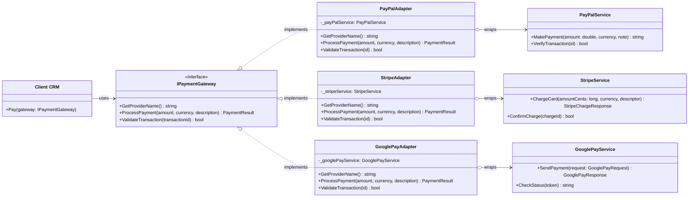
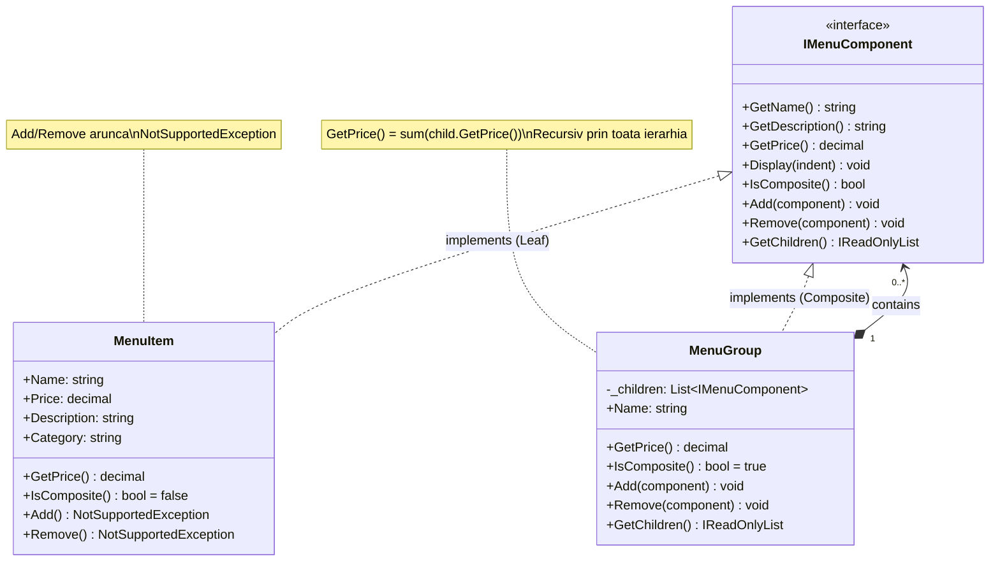
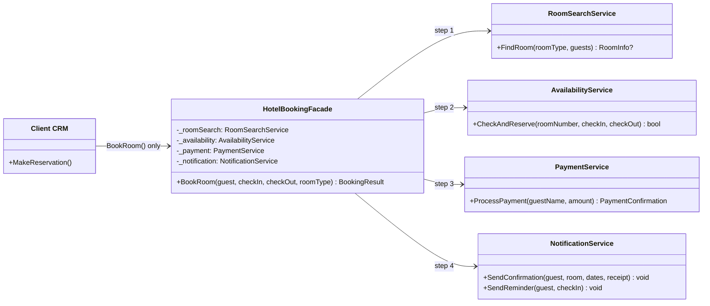

# Laborator 4 – Paternuri de Proiectare Structurale

## Adapter, Composite și Façade în proiectul TMPP_CRM

---

## 1. Adapter Pattern

### Ce este?
Adapter permite colaborarea între clase cu **interfețe incompatibile**, wrappând obiectul incompatibil într-un adaptor care traduce apelurile.

### Componentele implementate

| Clasa | Rol |
|---|---|
| `IPaymentGateway` | Target – interfața comună pe care clientul o cunoaște |
| `PayPalService` | Adaptee – API incompatibil PayPal |
| `StripeService` | Adaptee – API incompatibil Stripe (lucrează în cenți) |
| `GooglePayService` | Adaptee – API incompatibil Google Pay (cu obiecte Request) |
| `PayPalAdapter` | Adaptor PayPal: `decimal → double`, wrappează `MakePayment()` |
| `StripeAdapter` | Adaptor Stripe: `amount × 100 cenți`, wrappează `ChargeCard()` |
| `GooglePayAdapter` | Adaptor Google Pay: construiește `GooglePayRequest`, wrappează `SendPayment()` |

### Cum funcționează în CRM?

```csharp
// Acelasi cod client – adaptori interschimbabili
IPaymentGateway gateway = new PayPalAdapter();   // sau StripeAdapter / GooglePayAdapter
var result = gateway.ProcessPayment(150m, "RON", "Achizitie CRM");
bool valid = gateway.ValidateTransaction(result.TransactionId);
```

### Beneficii
- ✅ Integrare provideri terți fără modificarea codului client
- ✅ Înlocuire ușoară a unui provider cu altul
- ✅ Fiecare adaptor traduce diferențele: `double`, cenți, obiecte Request

---

## 2. Composite Pattern

### Ce este?
Composite permite tratamentul **uniform** al obiectelor individuale și al colecțiilor de obiecte prin aceeași interfață. Structura este arborescentă (arbore de componente).

### Componentele implementate

| Clasa | Rol |
|---|---|
| `IMenuComponent` | Component – interfața comună pentru frunze și noduri |
| `MenuItem` | Leaf – produs individual; `Add/Remove` aruncă `NotSupportedException` |
| `MenuGroup` | Composite – conține copii; `GetPrice()` sumează recursiv |

### Cum funcționează în CRM?

```csharp
var meniu = new MenuGroup("Meniu Pranz");
meniu.Add(new MenuItem("Supa", 15m));
meniu.Add(new MenuItem("Friptura", 45m));

var extra = new MenuGroup("Extra");
extra.Add(new MenuItem("Desert", 20m));
meniu.Add(extra);

// Tratament uniform – clientul nu stie daca e frunza sau grup
decimal total = meniu.GetPrice(); // 15 + 45 + 20 = 80 RON
```

### Beneficii
- ✅ Ierarhii de orice adâncime tratate uniform
- ✅ `GetPrice()` calculează recursiv fără cod special
- ✅ Adăugare/eliminare componente fără a modifica clientul

---

## 3. Façade Pattern

### Ce este?
Façade oferă o **interfață simplificată** pentru un subsistem complex, ascunzând implementările interne.

### Componentele implementate

| Clasa | Rol |
|---|---|
| `RoomSearchService` | Subsistem 1: caută camere după tip și număr de locuri |
| `AvailabilityService` | Subsistem 2: verifică și blochează intervalul |
| `PaymentService` | Subsistem 3: procesează plata, emite chitanță |
| `NotificationService` | Subsistem 4: trimite email de confirmare |
| `HotelBookingFacade` | **Façada**: `BookRoom()` orchestrează toate 4 subsisteme |

### Cum funcționează în CRM?

```csharp
// Clientul apeleaza O SINGURA metoda
var facade = new HotelBookingFacade();
BookingResult rezervare = facade.BookRoom(
    "Ion Popescu",
    DateTime.Today.AddDays(1),
    DateTime.Today.AddDays(3),
    "Deluxe"
);
// Intern: RoomSearch → Availability → Payment → Notification
```

### Beneficii
- ✅ Clientul nu cunoaște subsistemele interne
- ✅ Schimbarea unui subsistem nu afectează clientul
- ✅ Testare și validare centralizată în Façadă

---

## Sumar Paternuri

| Pattern | Problema rezolvată | Exemplu în CRM |
|---|---|---|
| **Adapter** | Interfețe incompatibile între clase | Gateway-uri de plată (PayPal/Stripe/GooglePay) |
| **Composite** | Ierarhii tratate uniform | Meniu restaurant cu submeniuri recursive |
| **Façade** | Complexitate subsisteme ascunsă | Rezervare hotel: 4 subsisteme, 1 metodă |

---

## Diagrame UML

### 1. Adapter Pattern – Diagramă de Clase



---

### 2. Composite Pattern – Diagramă de Clase



---

### 3. Façade Pattern – Diagramă de Clase



---

## Teste Unitare

Proiect: `TMPP_CRM.Tests` (xUnit, .NET 8)

| Fișier | Teste | Acoperire |
|---|---|---|
| `AdapterTests.cs` | 15 | Interfață, GetProviderName, ProcessPayment, ValidateTransaction, Theory interschimbabilitate |
| `CompositeTests.cs` | 13 | MenuItem leaf, MenuGroup sumă, ierarhii nested, NotSupportedException |
| `FacadeTests.cs` | 13 | Rezervare reușită, calcul nopți/preț, validări eșec (nume gol, date invalide, tip cameră) |
